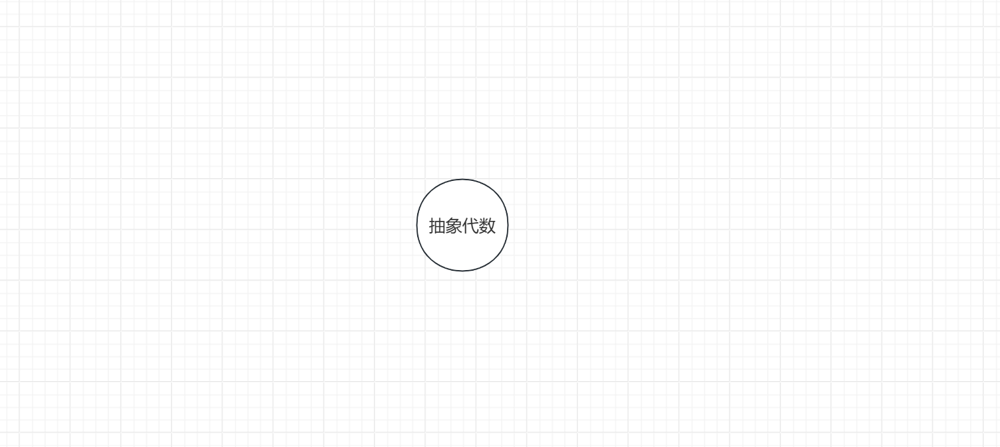

## 前言

这个仓库只放一些markdown，想要利用这个仓库达到三级目标

+ 没事儿发点数学牢骚，写点随笔啥的
+ 能够形成逻辑严密，内容详细的文档，共大家参考
+ 能够为初次接触相关内容的朋友提供教学

目前来看，第一个目标是显然能够达到的。作者正在向第二个目标迈进

## 图目录

*图目录说明：这些文档并没有严格的阅读先后顺序，但是作者会在编写的时候默认读者了解当前节点的前驱节点的内容*

## 索引目录

[抽象代数](抽象代数.md)