## 数据库基本概念

#### 什么是数据库

数据库（Database）是指按照一定的数据模型组织、存储和管理数据的集合。它是为了方便用户存取数据、简化数据管理而设计和构建的。数据库可以用来存储各种类型的数据，如文本、图像、音频等。

#### 数据库的一些特点

一、数据结构化

1.数据的整体结构化是数据库的主要特征之一

2.整体结构化：

（1）不再仅仅针对某一个应用，而是面向全组织

（2）不仅数据内部结构化，整体是结构化的，数据之间具有联系

（3）数据记录可以变长

（4）数据的最小存取单位是数据项

二、数据的共享性高，冗余度低且易扩充

1.数据面向整个系统，可以被多个用户、多个应用共享使用

2.数据共享的好处

（1）减少数据冗余，节约存储空间

（2）避免数据之间的不相容性与不一致性

（3）使系统易于扩充

三、数据独立性高

1.物理独立性：指用户的应用程序与数据库中数据的物理存储是相互独立的。当数据的物理存储改变了，应用程序不用改变。

2.逻辑独立性：指用户的应用程序与数据库的逻辑结构是相互独立的。数据的逻辑结构改变了，应用程序不用改变。

3.数据独立性由数据库管理系统的二级映像功能来保证。

四、数据由数据库管理系统统一管理和控制

数据库管理系统提供的数据控制功能：

（1）数据的安全性保护：保护数据以防止不合法的使用造成的数据的泄密和破坏。

（2）数据的完整性检查：保护数据的正确性、有效性和相容性。

（3）并发控制：对多用户的并发操作加以控制和协调，防止相互干扰而得到错误的结果。

（4）数据库恢复：将数据从错误状态恢复到某一已知的正确状态。


#### 关系型数据库

关系型数据库就是依照关系组建起来的数据库，它的呈现方式是一张表格，至于为什么是一张表格感兴趣可参见[其他部分](#其他部分（自行选读）)。常见的关系型数据库如MySQL，Oracle，Sql Server，Access

> 微软公司的Access常常被人吐槽：在数据量不大的时候不如Excel好用，在数据量很大的时候又不如MySQL好用。不过在一些地区，Access是高中信息课程中的内容

关系型数据库最大的优点就是数据结构清晰、易于理解、容易维护，能够确保数据的一致性和完整性。另外，关系型数据库还支持 SQL（Structured Query Language）语言，这是一种用于查询和操作数据库的标准语言，几乎所有的关系型数据库都支持 SQL

#### 非关系型数据库

即不依赖关系而组建起来的数据库。在更加复杂的开发场景中，我们要处理的数据五花八门，有可能无法像表格一样组织起来，这个时候就需要使用非关系型数据库了。

常见的非关系型数据库，如`MongoDB`，`Redis`

#### Navicat

如果你读过做**e时代的主人**，那么想必你一定下载了Navicat，如果还没有，请速速按照下面的步骤安装！！！

[Navicat的下载链接](https://www.navicat.com/en/download/navicat-premium)，找到适合你电脑的版本进行下载并安装

然后打开NavicatCracker，你应该可以在群文件中找到

> 这个过程中，windows  defender可能会讲Navicat Cracker视为有风险的文件并且删除，你需要手动在Windows安全中心将其恢复

接着请打开[这篇博客](https://www.cnblogs.com/zktww/p/16327163.html)，在断网情况下进行操作，然后你的Navicat就可以用了

## SQL语句

[MySQL 中文文档 | MySQL 中文网](https://www.mysqlzh.com/)

SQL语句的一些例子如下

```SQL
SELECT * FROM users AS u LEFT JOIN admins AS a ON u.id = a.user_id ORDER BY u.id;

SELECT * FROM admins AS a LEFT JOIN users AS u ON u.id = a.user_id ORDER BY a.user_id;

SELECT * FROM users AS u INNER JOIN admins AS a ON u.id = a.user_id ORDER BY a.user_id;

INSERT INTO users (id,name) VALUES (101,"savanna");
```

+ SQL语句不区分大小写，但是为了可读性，通常把**SQL的关键字全大写**，表名、字段名等**自定义的东西用小写**
+ 一个SQL语句以分号结尾，这意味着对于过长的语句，可以多行编写，在最后一行结尾加上分号即可

#### 在Navicat中运行SQL语句

如下图，在上方菜单中进入**查询**，然后**新建查询**，就可以在下方工作区编写并运行`SQL`了

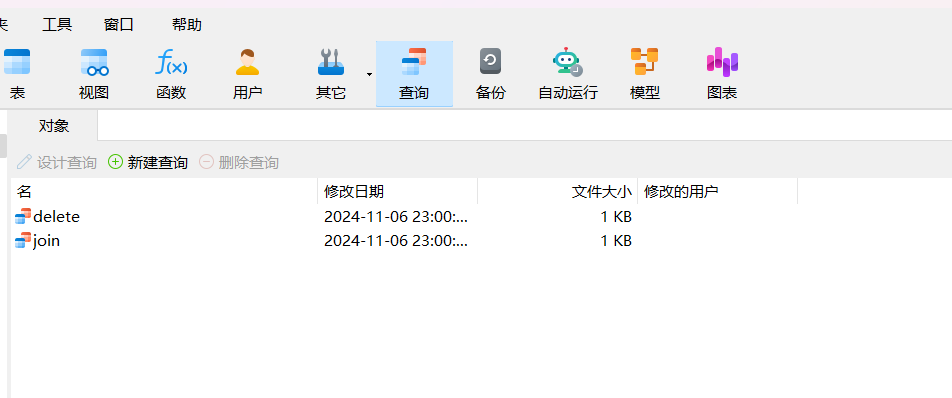

#### MySQL的数据类型

**数值类型**

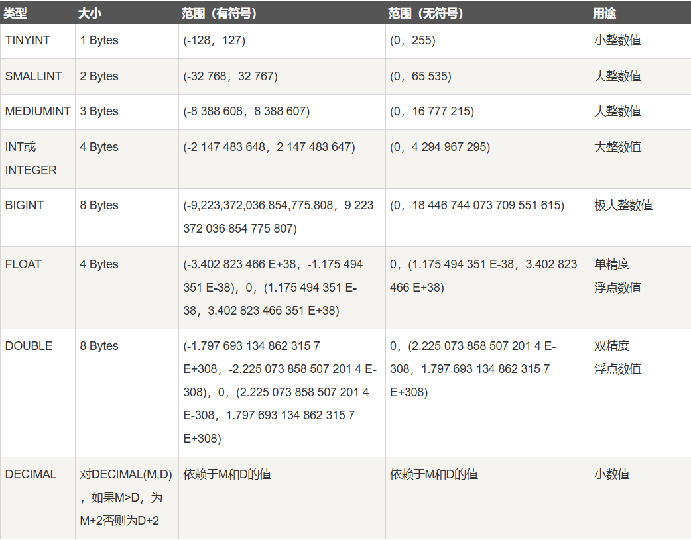

**日期和时间类型**

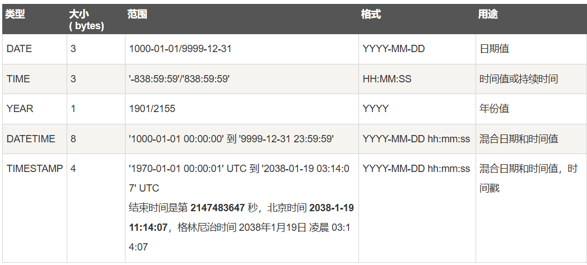

**字符串类型**

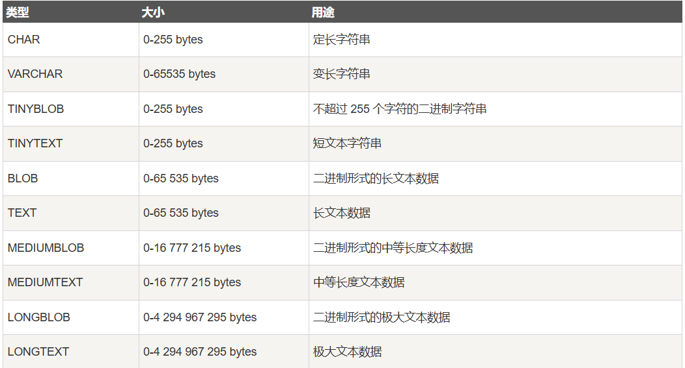

**枚举与集合类型**

- **ENUM**: 枚举类型，用于存储单一值，可以选择一个预定义的集合。
- **SET**: 集合类型，用于存储多个值，可以选择多个预定义的集合。

可以看到，MySQL支持的数据类型还是非常广泛的，能够满足日常业务开发的需要

#### 查询语句

```mysql
SELECT <column1,column2...> FROM <table name>;
SELECT * FROM <table name>;
```

上述语句可以从表中查出相应列的数据，如果想要直接把所有的数据都查出来，可以直接使用通配符`*`

当然了，我们并不总是要把所有的行、所有的列都查出来，那么我们可以为查询加上一些筛选条件，从而获取部分数据

```mysql
SELECT <column1,column2...> FROM <table name>
WHERE <condition>;
```

`condition`就是筛选的条件，例子如下

| 意义         | 符号                           | 例子                    |
| ------------ | ------------------------------ | ----------------------- |
| 大于（小于） | >（<）                         | age > 18（age < 18）    |
| 大于等于     | >= （<=）                      | age >= 18 （age <= 18） |
| 等于         | =         注意哦不是两个等于号 | age = 18                |
| 条件的且     | AND                            | age > 18 AND age < 60   |
| 条件的或     | OR                             | age < 12 OR age > 60    |
| 在...之间    | BETWEEN     AND                | age BETWEEN 18 AND 60   |

> 对于数字类型的数据，可以做比价，这是很好理解的；对于文字类型的数据，则按照字典序进行比较；对于时间类型的数据，则按照时间的先后进行比较

当然，这些返回的数据是无序的（其实是插入的先后顺序），我们想要按照一定的顺序返回，只要再加上一个字句

```mysql
SELECT <column1,column2...> FROM <table name>
WHERE <condition>
ORDER BY <column1,column2...>;
```

传入多个列名作为比较依据，那么靠前的列优先级更高

如果我们把结果作为几页查询出来呢，就需要使用到LIMIT关键字了

```mysql
SELECT <column,column2...> FROM <table name>
WHERE <condition>
LIMIT <start>,<limit>
OFFSET <offset>;
```

> 比如 LIMIT 20，5    表示从第21个开始，并返回连续的5条数据

当然，还有另外一个关键字OFFSET，可以和LIMIT一起使用，实现分页

```mysql
...
LIMIT 5
OFFSET 10
...
```

这和 LIMIT 10,5  的效果是一样的

> *LIMIT*关键字在某些情况下的性能是较差的，此处不做深究，可自行查阅相关资料

#### 插入语句

使用下面的语句来插入数据

```mysql
INSERT INTO <table name> (column1,column2...) VALUES (value1,value2...)
```

这种方式可以指定你想要填入数据的列，如果不指定列，那么在`VALUES`后面跟的值的顺序要和表头的顺序一致

```mysql
INSERT INTO <table name> VALUES (value1,value2...);
```

插入的时候，值必须满足表的所有限制，比如不能为空，或者长度限制等。

#### 更新语句

更新一些数据使用下面的语句

```mysql
UPDATE <table name> SET column1 = value1,column2 = value2 WHERE <condition>;
```

在使用UPDATE的时候请保证有WHERE字句的限制，否则会将所有的数据都更新

#### 删除语句

删除数据使用下面的语句

```mysql
DELETE FROM <table name> WHERE <condition>;
```

这种删除方法会直接把数据从数据库中删除，称为**硬删除**，此外还有一种删除的方法，即添加一个字段来判断是否删除，比如添加`deleted_at`字段来记录删除时间，如果没有删除则置空，被称为**软删除**。在某些场景下，软删除可能更加合适。

那么相应的，在软删除中，我们并不需要真的删除数据，只要更新一个字段即可，比如：

```mysql
UPDATE admins SET deleted_at = NOW() WHERE id = 2;
```

#### 更高级的查询

在讲更高级的查询之前，我们首先了解表的连接


看这张图还是比较抽象的，我们举一些具体的例子来看看。

假如有如下的两张表，从上到下分别是sheet1，sheet2

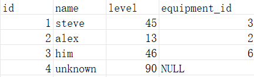

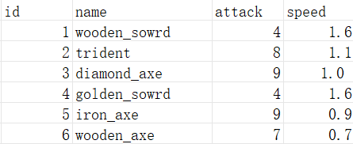

那么可以看出，sheet1是一张玩家信息的表，sheet2是一张装备信息的表，于是有：

sheet1左连接sheet2

```mysql
SELECT * FROM sheet1 AS s1 LEFT JOIN sheet2 AS s2 ON s1.equipment_id = s2.id;
```

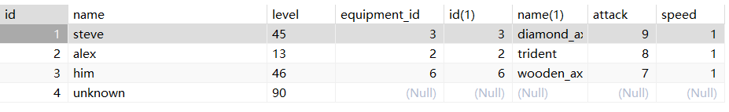

可以看到，sheet1的全部数据都在，而sheet2的数据仅仅按照sheet1的equipment_id添加到sheet2中

那么对称地，我们有右连接

```mysql
SELECT * FROM  sheet1 AS s1 RIGHT JOIN sheet2 AS s2 ON s1.equipment_id = s2.id;
```

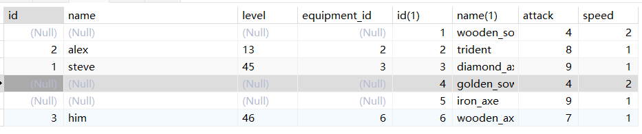

尽管sheet1在Navicat里被放在了左边，但这确实是sheet1 RIGHT JOIN sheet2

> 可以自行验证，sheet1 LEFT JOIN sheet2 和 sheet2 RIGHT JOIN sheet1 是等价的

sheet1 内连接 sheet2

```mysql
SELECT * FROM sheet1 AS s1 INNER JOIN sheet2 AS s2 ON s1.equipment_id = s2.id;
```


内连接的结果和左连接或者右连接是相似的，从上面的图示也可以看出，它是取了两张表的交集连接在一起

#### 内置函数

MySQL有很多内置函数可直接调用，此处不一一列出，可自行参考<a href="https://www.runoob.com/mysql/mysql-functions.html">菜鸟教程</a>

## Gorm的简单使用

[Gorm官方文档](https://gorm.io/zh_CN/docs/)

Gorm是一个Go语言的第三方库，实现了对关系型数据库的操作，使用下面的命令在获取Gorm

```cmd
go get -u gorm.io/gorm
go get -u gorm.io/driver/sqlite
```

#### 什么是ORM

ORM，即关系对象映射(Object Relation Mapping)，即编程中的对象和数据库中的关系之间的映射，我们在具体的操作数据库的时候，就不需要再去和复杂的SQL语句打交道，只要像平时操作对象一样操作它就可以了 。

ORM和数据访问层之间的联系在于它们都涉及到数据库操作的抽象和封装。ORM将面向对象的数据模型映射到关系型数据库的表结构，使得开发人员可以使用面向对象的编程语言来编写数据库操作。数据访问层将数据库操作与业务逻辑分离，使得系统更加模块化、可维护。

ORM可以看作是数据访问层的一种实现方式，它将数据库操作抽象为面向对象的编程语言，使得开发人员可以更容易地编写和维护数据库操作。数据访问层则是一种设计模式，它将数据库操作与业务逻辑分离，使得系统更加模块化、可维护。

Gorm，就是Go语言中的ORM，如上文所说，它是一个第三方库。

#### 让应用程序和数据库连接起来

我们前面说到，一个应用程序想要操作数据库，首先要和数据库建立连接。那么对于你的后端应用程序而言，当然也需要建立起连接，Gorm为我们提供了如下的建立连接的方式

```go
dsn := "<user>:<password>@tcp(<host>:port)/<dbname>?charset=utf8mb4&parseTime=True&loc=Local"
db, err := gorm.Open(mysql.Open(dsn), &gorm.Config{})
```

将其中的空缺部分补全，就可以建立和数据库的连接

`Open`方法所接受的第二个参数，是有关连接的配置，在这里，我们暂时不进行任何配置

或者你也可以采用下面的方法(来自官方文档)

```go
db, err := gorm.Open(mysql.New(mysql.Config{
  DSN: "gorm:gorm@tcp(127.0.0.1:3306)/gorm?charset=utf8&parseTime=True&loc=Local", // DSN data source name
  DefaultStringSize: 256, // string 类型字段的默认长度
  DisableDatetimePrecision: true, // 禁用 datetime 精度，MySQL 5.6 之前的数据库不支持
  DontSupportRenameIndex: true, // 重命名索引时采用删除并新建的方式，MySQL 5.7 之前的数据库和 MariaDB 不支持重命名索引
  DontSupportRenameColumn: true, // 用 `change` 重命名列，MySQL 8 之前的数据库和 MariaDB 不支持重命名列
  SkipInitializeWithVersion: false, // 根据当前 MySQL 版本自动配置
}), &gorm.Config{})
```

> **连接池**：数据库连接池是一种管理和维护数据库连接的机制，用于提高数据库访问的性能和效率。连接池通过在应用程序启动时创建一组数据库连接，并在需要时将这些连接分配给应用程序，然后在不再需要时将其返回到池中。这可以减少创建和销毁数据库连接的开销，并优化数据库资源的使用。

连接的创建和销毁开销：
创建和销毁数据库连接是一项开销较大的操作。连接池通过预先创建一组连接，避免了每次请求都创建新连接的开销。这些连接在应用程序启动时初始化，并一直保持活动状态，直到应用程序关闭。

连接的重用：
连接池允许应用程序在需要时从池中获取连接，而不是每次都创建新连接。使用完毕后，连接可以被释放回池中以供其他请求使用。这种重用机制可以降低数据库服务器的负担，提高应用程序的性能。

#### tz-gin中的Gorm

tz-gin中的Gorm代码基本上都在model层中，`init.go`中包含了数据库连接，以及日志相关的内容，在新建一个tz-gin项目之后，首先是修改环境变量（请参考README.md），然后可以填入自己的MySQL用户名，密码，和要建立连接的数据库，这样就可以了。

如果你要新建一个模型，那么请在model层下新建一个文件，并完成模型的定义，之后在`initModel`函数中的`AutoMigrate`处完成模型的注册

`resource-example.go`是一个示例，仅供参考

定义好相关模型之后，接下来就容易许多了，只需要去controller层和service层继续你的代码就行

#### 定义一个模型

你需要在model层完成定义，一个例子如下

```go
type User struct{
    BaseModel
    Name string `gorm:"column:name;comment:姓名;type:VARCHAR(20)"`
    Age uint8 `gorm:"column:age;comment:年龄"`
}
```

如果你对属性有一些自定义的要求，那么需要手动在属性的末尾加上gorm的标签，column表示列名，comment表示注释，type表示类型，此处VARCHAR(20)表示20个字长的字符串

保持良好风格，我们推荐每个属性都至少写column和comment

一些对表的设置也是在此处添加，我们后面会讲到，比如对外键的设置

写好结构体之后，就可以如上所说去完成注册，然后查看MySQL发现多了一张表，而且**表的名字还是结构体名字的复数**

注意：AutoMigrate完成自动迁移之后，如果后续在模型中添加属性，那么这个修改会迁移到数据库中，如果是删除某个字段，那么不会被迁移，因为MySQL要保持数据的完整性，这个时候你只能删除这张表重来了

#### 基础的Gorm语句

这部分可以和SQL语句对应起来，既然SQL实现了增删查改，那么使用Gorm语句也要实现增删查改

我们先来看一个Gorm语句的例子，这样或许你能理解Gorm的便捷之处

```go
if err := model.DB.Table("students").
	Joins("LEFT JOIN interviews AS intervs ON intervs.netid = students.netid").
	Joins("LEFT JOIN questions AS ques ON ques.id = students.qid").
	Select("students.*", "intervs.time", "ques.question").
	Find(&info).Error; err != nil {
}
```

你看到这个语句大概就能理解干了什么事儿，这个语句进行了两次连接，然后查出了联表中的部分信息。由于每个字句的返回值都是`*gorm.DB`类型，所以可以像上面这样链式调用，然后取出最终结果。我们还可以同时进行错误处理，如果数据库操作出错，那么把错误提取出来，然后进行后续的处理

**Model,Table**

一个数据库里有很多表，我们要指定哪一张表进行操作，可以使用Table或者Model

Model是指定模型，因为ORM是将对象映射到关系，对象的类即为模型，上面在tz-gin中讲到了，有整整一个model层用来连接数据库，所以我们更推荐使用Model而不是Table

```go
DB.Model(&Student{}) // 接下来就将操纵students表

DB.Table("students") // 接下来也将操纵students表
```

当然在Table里也是可以给表取别名的

```go
DB,Table("students AS stus")
```

> 不用Table的另一个原因是，假设你的表名有变化，那么你还需要在每个Gorm语句的Table中去修改表名，很麻烦，~~当然你也可以存个全局变量，但是没必要~~，而使用Model就不会有这样的问题

但是Gorm有的时候其实是不需要你显式地指明Model或者Table的，我们将在接下来的例子中见到

**Where**

Where的用法和SQL中Where的用法几乎相同，它接受一个字符串作为筛选的条件，但是它使用`?`来作为占位符，然后再接受一些替换占位符的变量，进行筛选，如下：

```go
DB.Where("id > ?",1024)
```

1024将替换字符串中的`?`，所以这个筛选就是筛选出所有id>1024的数据

除了`>,<,=`这样的比较符，也可以使用`IN`来进行包含判断，如下

```go 
DB.Where("id IN ?",[]int{1024,1028,1032})
```

这个筛选会筛选出id在数组{1024,1028,1032}中的数据

也可以使用`LIKE`进行模糊的判断，如下

```go
DB.Where("name LIKE","%syl")
```

这个筛选会筛选出name字段以syl结尾的数据

如果你有多个筛选条件，那么使用`AND`和`OR`来连接它们

```go
DB.Where("id > ? AND id < ?",10,15)
DB.Where("age < 18 OR age > 60")
```

最后要说的就是，如果表中含有`deleted_at`字段，并且不为空，那么这些数据不会被Where筛选出来

**Not**

如果你想让筛选出不满足某个条件的数据，使用Not

```go
DB.Where("id > 20").Not("id = ?",30)
```

这个筛选会筛选出id>20的所有数据，除了id=30的那条

Not接受的参数和Where相同

**SELECT**

也是和SQL相同，就是选出要查询的列，若有多个列，用`,`隔开，如下

使用`*`作为通配符查出所有的列

```go
DB.Select("name,age,hometown")
DB.Select("*")
```

**Find,First,Last**

这三个都是用于取出查询结果，接受一个可作为`interface{}`的变量，用来承接结果，它们的区别从名字就可以看出来，`First`取出符合条件的第一条数据，`Find`取出符合条件的所有数据，`Last`取出符合条件的最后一条数据。当然了，因为`Find`可能取出多条数据，也可能取出一条数据，所以`Find`接受的变量还必须可迭代，比如数组，切片。一些例子如下

```go
// Student是一个定义过的结构体
var stuInfo1,stuInfo2 Student
var stuInfos []Student

DB.Where("id = >",15).First(&stuInfo1)
DB.Where("id < ?",15).Last(&stuInfo2)
DB.Where("id > ? AND id < ?",10,15).Find(&stuInfos)
```

注意到，这三个方法接受的参数都是有类型的，通常情况下，我们会使用他们的模型作为类型，这个时候传入到比如Find中，其实这个Gorm语句的模型或者说表就被指定了，那么不再需要在前面显式的指出Model或者Table。但是如果想偷懒呢，比如把`stuInfo1`的类型改成`interface{}`（反正也能承接），再查询呢？那么你会看到下面的信息

```
unsupported data type: &[]: Table not set, please set it like: db.Model(&user) or db.Table("users")
```

这是说，此语句的Model或者Table没有被指定：因为你在前面就没有显式的指定，而从承接结果的变量类型中也看不出来，所以会出现这样的问题

**Limit,Offset**

用来做分页的，用法和SQL相同

```go
DB.Where("id > ?",1000).Limit(5).Offset(10)
```

**Count**

读取查询出来的数据条数，接受一个`int64指针`类型的变量

```go
var total int64

DB.Model(&Student{}).Where("id < ?",10086).Count(&total)
```

**Create**

创建数据，接受的数据应该满足数据库表的限制，否则会创建失败

```go
DB.Create(&Student{
    Name: "example",
    //
})
```

和上面的Find那里一样，Create接受的变量的类型已经指明了Model，所以不需要显式声明

另外Create支持批量创建，如果传入的数据是`*[]Student`类型，那么会创建多条数据

**FirstOrCreate**

顾名思义，根据主键查询查询某条数据，如果这条数据不存在，那么就创建一条

**Update,Updates**

Update接受两个参数，分别是要更新的字段和更新的值，Update可以链式调用。Gorm的更新必须要有筛选条件，即必须有Where

```go
DB.Where("id > ?",10).Model(&Student{}).Update("status","active").Update("updated_at",time.Now())
```

当然如果你有多个字段要更新，那么一个一个的调Update太麻烦了，直接使用Updates。一般我们用Updates时会传入一个结构体，然后会把属性名和字段名，属性值和字段值对应更新。此外，**如果某个属性没有赋值，那么Updates不会更新它，而不是置空**

```go
info := struct{
    Name string
    Password string
    Slogan string
}{
    Name: "Trader",
    Slogan: "总有一天他们会讲述你的传奇...那一定是个好故事",
}
```

如上例，数据库表中的name和slogan字段会更新，而password不会，因为没有赋值

**Save**

这是一个将创建个更新结合到一起的方法，直接看例子

```go
DB.Save(&Student{
    ID: 10,
    Name: "曲速泡",
    Password: "进度要什么密码",
    Slogan: "超传7000格",
})
```

为什么这里出现了ID字段，之前都没有的？这是区分创建还是更新的重要标识，如果传入的数据中主键被指定了，那么就会找到对应的数据进行更新，否则就会创建。所以这个语句的意思是：把 id=10 的数据的各字段值更新；如果没有这个`ID: 10,`那么就会新创建一条数据

**Delete**

Delete就是要注意，指定删除的条件，别不小心把数据全删了

```go
DB.Where("score < ?",60).Delete(&model.Student{})
```

要是Delete接受的结构体的主键有值，那么也可以不要Where

```go
DB.Delete(&model.Student{
    ID: 5,
}) // 删除id为5的数据
```

**Error**

我们前面说过Gorm是可以同时进行错误处理的，那么获取一个Gorm语句中的错误是很简单的，理想的Gorm语句如下例

```go
if err := DB.Model(&Student{}).Where("score > 60").Update("passed",true).Error;err != nil{
    // 进行错误处理
    ...
}
```

通过Error方法来获取错误，如果有错误则进行相关处理，否则继续执行

**Joins**

联表的概念在前面已经说过了，这里只谈用法（其实最开始的例子那里已经有了）

为了更清楚的展示连接的关系，我们这里使用Table而不用Model

并假设已经定义了下面两个结构体

```go
type Student struct{
    BaseModel
    Name string
    Age uint8
    CourseID int
}

type Course struct{
    BaseModel
    Name string
    Duration uint8
}
```

```go
DB.Table("students").Joins("LEFT JOIN courses AS cs ON cs.id = students.course_id") // 左连接
DB.Table("students").Joins("RIGHT JOIN courses AS cs ON cs.id = students.course_id") // 右连接
DB.Table("students").Joins("INNER JOIN courses AS cs ON cd.id = students.course_id") // 内连接
```

可以看到，`Joins`里接受的这个字符串就是对应连接的SQL语句，所以你只要会用SQL里的连接，也就会这里的连接。但是请避免大量使用这种连接，我们前面已经说过，它是基于笛卡尔积的，效率非常低。我们应该使用下面将要提到的更高效的方法

## 一对多，多对多，事务

我们知道，表与表之间往往存在一定的关联，所以我们可以使用联表来实现，但是这种方式非常的慢，那么我们有多种方式来更加高效地实现

#### 主键，外键，索引

主键，primaryKey，一个可以唯一标识一条数据的字段，比如身份证号可以作为主键，但是姓名不行，因为会有重名

这意味着，主键的值在表中是唯一的

主键笑话一则


我们上面用到的例子中，ID是主键。事实上，tz-gin的model层定义的BaseModel已经添加了ID作为主键，我们只要直接使用就可以了

复合主键：指主键由多个字段组成，这就是说尽管这些字段单独在表中不一定唯一，但它们的组合在表中唯一，举个不恰当的例子：name和age组成了复合主键，name = Asice-Cloud不一定唯一，age = 19不一定唯一，但是(name = Asice-Cloud , age = 19)这个组合是唯一的（只是个例子，在实际中这也不一定唯一）

外键：foreignKey，引用的另一个表的主键，用来建立表之间的联系。比如Student和Course模型中，Student.CourseID，就是引用了Course的主键ID，那么它的值也只可能为表Courses中存在的值，而不会是其他值

基于这样的限制，当某条数据的主键被其他表作为外键且存在时，你是不能直接进行删除的。一般情况下你只有将所有有关它的引用都删除才可以删除它本身，但是如果你嫌麻烦的话可以预先进行一些设置，就可以直接删除了，别急一会儿讲到

索引：index，索引是一种提高查询速度的方式，举个例子：你在字典里查单词，不需要把整本字典都翻一遍，只需要看看第一个字母，然后翻到相应的区域，然后继续重复操作。索引加快速度的代价是存储空间的增加。下面是一些常见的索引

+ 普通索引：MySQL中基本索引类型，没有什么限制，允许在定义索引的列中插入重复值和空值
+ 唯一索引：索引列中的值必须是唯一的，但是允许为空值
+ 全文索引：只能在文本类型CHAR,VARCHAR,TEXT类型字段上创建全文索引。字段长度比较大时，如果创建普通索引，在进行like模糊查询时效率比较低，这时可以创建全文索引。 MyISAM和InnoDB中都可以使用全文索引
+ 前缀索引：在文本类型如CHAR,VARCHAR,TEXT类列上创建索引时，可以指定索引列的长度，但是数值类型不能指定
+ 复合索引：类似于复合主键，多个字段构成一个索引

说了这么多，我们来看看怎么在Gorm中加索引

```go
type Student struct{
    BaseModel
    Name string `gorm:index` // 普通索引
    Netid string `gorm:"uniqueIndex"` // 唯一索引
    Age int `gorm:"index:idx_age_gender"`
    Gender string `gorm:"index:idx_age_gender"` // 复合索引
    Slogan string `gorm:"index:idx_slogan_prefix(20)"` // 前缀索引
}
```

> 合理使用索引，毕竟速度的加快不是无代价的

#### hasone，hasmany

即一对一，一对多关系，比如，人和钱包是一对多关系，因为一个人可以有多个钱包， 但是一个钱包只能由一个人拥有。在Grom中，我们在定义模型的时候通过外键来实现

```go
type Wallet struct{
	BaseModel
    UserID int64 `gorm:"column:user_id"`
    // 一些其他属性
}

type User sturct{
    BaseModel
    Wallets []Wallet `gorm:"foreignKey:UserID"`
}
```

然后我们可以在Navicat中查看相关的表，发现表中由相关的外键。一个查询这种关系的例子如下

```go
func (s Service) Get() (model.User, error) {
	var data model.User
	err := model.DB.Preload("Wallets").First(&data).Error
	if err != nil {
		fmt.Println("\n", "\033[31m"+err.Error()+"\033[0m\n")
	}
	return data, err
}
```

> 有个主讲人在这里看了半天空指针，最终发现原来err才是nil

我们在查询的时候，肯定是希望把User的所有的Wallet也一起查出来，这就是Preload的作用，预加载Wallet模型

我们可以看一下Gorm生成的SQL语句，看看是如何被查出来的

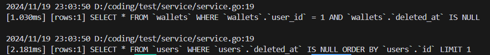

通过两个查询语句就得到了结果，时间复杂度是 $O(m+n)$，而使用联表查询作笛卡尔积地复杂度是 $O(mn)$，$m$是Users表长，$n$是Wallets表长，在性能上显然是要提升了不少的。

如果没有Preload，那么有关Wallets的查询不会执行，相应的属性值也会被置空

我们前面讲外键的时候，说过外键的删除有数据完整性的限制，但是可以通过一些设置来取消这些限制，设置如下：

```go
type Wallet struct{
	BaseModel
    UserID int64 `gorm:"column:user_id;constraint:Ondelete: SET NULL"`
    // 一些其他属性
}

type User sturct{
    BaseModel
    Wallets []Wallet `gorm:"foreignKey:UserID"`
}
```

#### many2many

many2many是一种多对多的对应关系，比如人和语言，一个人可以会多种语言，一门语言也可以被很多人说。Gorm实现这种多对多关系的方式是增加一张表来记录这种对应关系，例子如下

```go
type Language struct{
    BaseModel
    Users []*User `gorm:"many2many:user_language"`
}

type User struct{
    BaseModel
    Languages []*Language `gorm:"many2many:user_language"`
}
```

 这样Gorm会创建一张`user_language`表，用来存储多对多的关系，同样的，使用Preload方法来将模型本身的数据和对应的关联模型的数据一起查出来

当然， 如果就像上面这样定义多对多的连接表的话，是没有任何外键的，这意味着连接表的值可能会存在一些不存在的东西

#### 修改关联关系

hasone的修改直接按照正常的表修改就行，hasmany和many2many可以通过Association方法来修改

```go
// 首先我们需要把相关的数据查出来
var user model.User
DB.Where("id = 1").First(&user)

DB.Model(&user).Association("Wallets").Append(&Wallet{})  // 添加一条关联数据
// 下面的两个方法必须要求Wallet结构体有主键数据
DB.Model(&user).Association("Wallets").Delete(&Wallet{}) // 删除一条关联数据
DB.Model(&user).Association("Wallets").Replace(&Wallet{}) // 替换一条关联数据

DB.Model(&user).Association("Wallets").Clear() // 清空所有关联
DB.Model(&user).Association("Wallets").Count() // 计数
```

需要注意的是，这些操作都是在关联关系上操作的，比如删除并不是删除表中数据，而是把外键置空

#### 事务

在MySQL中，事务（Transaction）是一组SQL语句的集合这些语句作为一个单独的逻辑工作单元执行。事务的目的是确保在数据库操作中的一组SQL语句被视为一个不可分割的原子操作。也就是说，如果其中任何一个语句失败，整个事务将回滚并恢复到事务开始前的状态。

MySQL使用ACID模型来保证事务的原子性、一致性、隔离性和持久性。这意味着：

+ 原子性（Atomicity）：事务是一个单独的逻辑单元，要么全部完成，要么全部撤销。如果事务的任

何部分失败，整个事务都将被回滚。

+ 一致性（Consistency）：事务执行后，数据库必须始终处于一致状态。这意味着，当事务完成

时，所有数据必须符合所有约束和限制。

+ 隔离性（Isolation）：每个事务都必须被隔离开来，以此防止互相干扰。这保证了同时运行的多个

事务之间不会发生不可预知的相互作用。

+ 持久性（Durability）：一旦事务完成，则对数据库所做的更改必须永久保存在数据库中，不能因为

系统崩溃等意外事件而丢失。

在Gorm中使用事务是一件容易的事情

使用Transaction

```go
DB,Transaction(func(tx *gorm.DB)error{
    // 你的代码
}).Error
```

手动管理事务

```go
tx := DB.Begin()
// 一些代码
tx.SavePoint("update finished")

// code
if err := .....Error;err != nil{
    tx.Rollbackto("update finished")
    return
}

// code 
if err := ......Error;err != nil{
    tx.Rollback()
    return
}
tx.Commit()
```

使用Begin来开启事务，Commit来提交事务。使用SavePoint来保存一些关键节点，然后可以使用Rollback和Rollbackto来在遇到错误的时候回滚。

这种方法非常简单，如果内层函数的返回值没有错误，那么事务会被提交，否则会回滚

> 事务虽好，但是带来的额外开销也不少，所以不要滥用事务，查询这种完全不会动数据库的就不要开事务了。另外事务记得关闭，不然给你泄个18MB内存😡😡😡

## Redis

Redis是一个开源（BSD许可），内存存储的数据结构服务器，可用作数据库，高速缓存和消息队列代理。它支持字符串，哈希表，列表、集合、有序集合，位图，hyperloglogs等数据类型。

#### 下载Redis

<a href="https://github.com/tporadowski/redis/releases">下载链接</a>

#### 打开 Redis

安装好的Redis分为两部分，`Redis-server`和`Redis-cli`，即服务器和客户端。在终端中打开服务器，使用下面的命令

```power
redis-server
```

打开之后大概是这样的

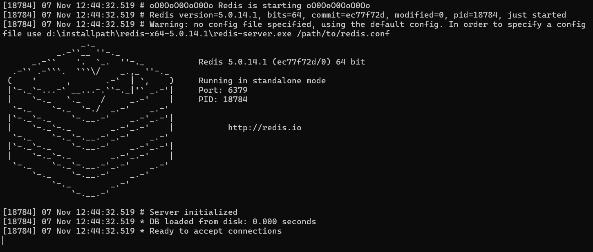

然后这个时候另外再打开一个终端，使用下面的命令打开客户端

```power
redis-cli
```

客户端打开之后大概是这样的

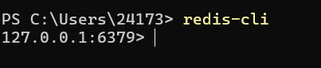

通常情况下，Redis是运行在6379端口的，然后就可以在客户端中使用Redis了

#### 使用 Redis

此处来自[Redis 教程 | 菜鸟教程](https://www.runoob.com/redis/redis-tutorial.html)

**字符串**

| 序号 | 命令及描述                                                   |
| :--- | :----------------------------------------------------------- |
| 1    | [SET key value](https://www.runoob.com/redis/strings-set.html) 设置指定 key 的值。 |
| 2    | [GET key](https://www.runoob.com/redis/strings-get.html) 获取指定 key 的值。 |
| 3    | [GETRANGE key start end](https://www.runoob.com/redis/strings-getrange.html) 返回 key 中字符串值的子字符 |
| 4    | [GETSET key value](https://www.runoob.com/redis/strings-getset.html) 将给定 key 的值设为 value ，并返回 key 的旧值(old value)。 |
| 5    | [GETBIT key offset](https://www.runoob.com/redis/strings-getbit.html) 对 key 所储存的字符串值，获取指定偏移量上的位(bit)。 |
| 6    | [MGET key1 [key2..\]](https://www.runoob.com/redis/strings-mget.html) 获取所有(一个或多个)给定 key 的值。 |
| 7    | [SETBIT key offset value](https://www.runoob.com/redis/strings-setbit.html) 对 key 所储存的字符串值，设置或清除指定偏移量上的位(bit)。 |
| 8    | [SETEX key seconds value](https://www.runoob.com/redis/strings-setex.html) 将值 value 关联到 key ，并将 key 的过期时间设为 seconds (以秒为单位)。 |
| 9    | [SETNX key value](https://www.runoob.com/redis/strings-setnx.html) 只有在 key 不存在时设置 key 的值。 |
| 10   | [SETRANGE key offset value](https://www.runoob.com/redis/strings-setrange.html) 用 value 参数覆写给定 key 所储存的字符串值，从偏移量 offset 开始。 |
| 11   | [STRLEN key](https://www.runoob.com/redis/strings-strlen.html) 返回 key 所储存的字符串值的长度。 |
| 12   | [MSET key value [key value ...\]](https://www.runoob.com/redis/strings-mset.html) 同时设置一个或多个 key-value 对。 |
| 13   | [MSETNX key value [key value ...\]](https://www.runoob.com/redis/strings-msetnx.html) 同时设置一个或多个 key-value 对，当且仅当所有给定 key 都不存在。 |
| 14   | [PSETEX key milliseconds value](https://www.runoob.com/redis/strings-psetex.html) 这个命令和 SETEX 命令相似，但它以毫秒为单位设置 key 的生存时间，而不是像 SETEX 命令那样，以秒为单位。 |
| 15   | [INCR key](https://www.runoob.com/redis/strings-incr.html) 将 key 中储存的数字值增一。 |
| 16   | [INCRBY key increment](https://www.runoob.com/redis/strings-incrby.html) 将 key 所储存的值加上给定的增量值（increment） 。 |
| 17   | [INCRBYFLOAT key increment](https://www.runoob.com/redis/strings-incrbyfloat.html) 将 key 所储存的值加上给定的浮点增量值（increment） 。 |
| 18   | [DECR key](https://www.runoob.com/redis/strings-decr.html) 将 key 中储存的数字值减一。 |
| 19   | [DECRBY key decrement](https://www.runoob.com/redis/strings-decrby.html) key 所储存的值减去给定的减量值（decrement） 。 |
| 20   | [APPEND key value](https://www.runoob.com/redis/strings-append.html) 如果 key 已经存在并且是一个字符串， APPEND 命令将指定的 value 追加到该 key 原来值（value）的末尾。 |

**哈希表**

```powershell
HMSET hash_table name "Asice Cloud" followers 12 following 10

HGET hash_table name // 根据键查询值
HGETALL hash_table // 查询所有键值对
HSET hash_table repo 15 // 设置某个键值对
HKEY hash_table // 查询所有键
HVALS hash_table // 查询所有值
HDEL hash_table repo // 删除某个键值对
```

****

**列表**


| 序号 | 命令及描述                                                   |
| :------ | :----------------------------------------------------------- |
| 1    | BLPOP key1 [key2 \] timeout   移出并获取列表的第一个元素， 如果列表没有元素会阻塞列表直到等待超时或发现可弹出元素为止。 |
| 2    | BRPOP key1 [key2 \] timeout   移出并获取列表的最后一个元素， 如果列表没有元素会阻塞列表直到等待超时或发现可弹出元素为止。 |
| 3    | BRPOPLPUSH source destination timeout   从列表中弹出一个值，将弹出的元素插入到另外一个列表中并返回它； 如果列表没有元素会阻塞列表直到等待超时或发现可弹出元素为止。 |
| 4    | LINDEX key index   通过索引获取列表中的元素 |
| 5    | LINSERT key BEFORE\|AFTER pivot value   在列表的元素前或者后插入元素 |
| 6    | LLEN key   获取列表长度 |
| 7    | LPOP key   移出并获取列表的第一个元素 |
| 8    | LPUSH key value1 [value2\]   将一个或多个值插入到列表头部 |
| 9    | LPUSHX key value   将一个值插入到已存在的列表头部 |
| 10   | LRANGE key start stop   获取列表指定范围内的元素 |
| 11   | LREM key count value   移除列表元素 |
| 12   | LSET key index value   通过索引设置列表元素的值 |
| 13   | LTRIM key start stop   对一个列表进行修剪(trim)，就是说，让列表只保留指定区间内的元素，不在指定区间之内的元素都将被删除。 |
| 14   | RPOP key   移除列表的最后一个元素，返回值为移除的元素。 |
| 15   | RPOPLPUSH source destination   移除列表的最后一个元素，并将该元素添加到另一个列表并返回 |
| 16   | RPUSH key value1 [value2\]   在列表中添加一个或多个值到列表尾部 |
| 17   | RPUSHX key value   为已存在的列表添加值 |

**集合**


| 序号 | 命令及描述                                                   |
| :--- | :----------------------------------------------------------- |
| 1    | [SADD key member1 [member2\]](https://www.runoob.com/redis/sets-sadd.html) 向集合添加一个或多个成员 |
| 2    | [SCARD key](https://www.runoob.com/redis/sets-scard.html) 获取集合的成员数 |
| 3    | [SDIFF key1 [key2\]](https://www.runoob.com/redis/sets-sdiff.html) 返回第一个集合与其他集合之间的差异。 |
| 4    | [SDIFFSTORE destination key1 [key2\]](https://www.runoob.com/redis/sets-sdiffstore.html) 返回给定所有集合的差集并存储在 destination 中 |
| 5    | [SINTER key1 [key2\]](https://www.runoob.com/redis/sets-sinter.html) 返回给定所有集合的交集 |
| 6    | [SINTERSTORE destination key1 [key2\]](https://www.runoob.com/redis/sets-sinterstore.html) 返回给定所有集合的交集并存储在 destination 中 |
| 7    | [SISMEMBER key member](https://www.runoob.com/redis/sets-sismember.html) 判断 member 元素是否是集合 key 的成员 |
| 8    | [SMEMBERS key](https://www.runoob.com/redis/sets-smembers.html) 返回集合中的所有成员 |
| 9    | [SMOVE source destination member](https://www.runoob.com/redis/sets-smove.html) 将 member 元素从 source 集合移动到 destination 集合 |
| 10   | [SPOP key](https://www.runoob.com/redis/sets-spop.html) 移除并返回集合中的一个随机元素 |
| 11   | [SRANDMEMBER key [count\]](https://www.runoob.com/redis/sets-srandmember.html) 返回集合中一个或多个随机数 |
| 12   | [SREM key member1 [member2\]](https://www.runoob.com/redis/sets-srem.html) 移除集合中一个或多个成员 |
| 13   | [SUNION key1 [key2\]](https://www.runoob.com/redis/sets-sunion.html) 返回所有给定集合的并集 |
| 14   | [SUNIONSTORE destination key1 [key2\]](https://www.runoob.com/redis/sets-sunionstore.html) 所有给定集合的并集存储在 destination 集合中 |
| 15   | [SSCAN key cursor [MATCH pattern\] [COUNT count]](https://www.runoob.com/redis/sets-sscan.html) 迭代集合中的元素 |

**有序集合**

| 序号 | 命令及描述                                                   |
| :--- | :----------------------------------------------------------- |
| 1    | [ZADD key score1 member1 [score2 member2\]](https://www.runoob.com/redis/sorted-sets-zadd.html) 向有序集合添加一个或多个成员，或者更新已存在成员的分数 |
| 2    | [ZCARD key](https://www.runoob.com/redis/sorted-sets-zcard.html) 获取有序集合的成员数 |
| 3    | [ZCOUNT key min max](https://www.runoob.com/redis/sorted-sets-zcount.html) 计算在有序集合中指定区间分数的成员数 |
| 4    | [ZINCRBY key increment member](https://www.runoob.com/redis/sorted-sets-zincrby.html) 有序集合中对指定成员的分数加上增量 increment |
| 5    | [ZINTERSTORE destination numkeys key [key ...\]](https://www.runoob.com/redis/sorted-sets-zinterstore.html) 计算给定的一个或多个有序集的交集并将结果集存储在新的有序集合 destination 中 |
| 6    | [ZLEXCOUNT key min max](https://www.runoob.com/redis/sorted-sets-zlexcount.html) 在有序集合中计算指定字典区间内成员数量 |
| 7    | [ZRANGE key start stop [WITHSCORES\]](https://www.runoob.com/redis/sorted-sets-zrange.html) 通过索引区间返回有序集合指定区间内的成员 |
| 8    | [ZRANGEBYLEX key min max [LIMIT offset count\]](https://www.runoob.com/redis/sorted-sets-zrangebylex.html) 通过字典区间返回有序集合的成员 |
| 9    | [ZRANGEBYSCORE key min max [WITHSCORES\] [LIMIT]](https://www.runoob.com/redis/sorted-sets-zrangebyscore.html) 通过分数返回有序集合指定区间内的成员 |
| 10   | [ZRANK key member](https://www.runoob.com/redis/sorted-sets-zrank.html) 返回有序集合中指定成员的索引 |
| 11   | [ZREM key member [member ...\]](https://www.runoob.com/redis/sorted-sets-zrem.html) 移除有序集合中的一个或多个成员 |
| 12   | [ZREMRANGEBYLEX key min max](https://www.runoob.com/redis/sorted-sets-zremrangebylex.html) 移除有序集合中给定的字典区间的所有成员 |
| 13   | [ZREMRANGEBYRANK key start stop](https://www.runoob.com/redis/sorted-sets-zremrangebyrank.html) 移除有序集合中给定的排名区间的所有成员 |
| 14   | [ZREMRANGEBYSCORE key min max](https://www.runoob.com/redis/sorted-sets-zremrangebyscore.html) 移除有序集合中给定的分数区间的所有成员 |
| 15   | [ZREVRANGE key start stop [WITHSCORES\]](https://www.runoob.com/redis/sorted-sets-zrevrange.html) 返回有序集中指定区间内的成员，通过索引，分数从高到低 |
| 16   | [ZREVRANGEBYSCORE key max min [WITHSCORES\]](https://www.runoob.com/redis/sorted-sets-zrevrangebyscore.html) 返回有序集中指定分数区间内的成员，分数从高到低排序 |
| 17   | [ZREVRANK key member](https://www.runoob.com/redis/sorted-sets-zrevrank.html) 返回有序集合中指定成员的排名，有序集成员按分数值递减(从大到小)排序 |
| 18   | [ZSCORE key member](https://www.runoob.com/redis/sorted-sets-zscore.html) 返回有序集中，成员的分数值 |
| 19   | [ZUNIONSTORE destination numkeys key [key ...\]](https://www.runoob.com/redis/sorted-sets-zunionstore.html) 计算给定的一个或多个有序集的并集，并存储在新的 key 中 |
| 20   | [ZSCAN key cursor [MATCH pattern\] [COUNT count]](https://www.runoob.com/redis/sorted-sets-zscan.html) 迭代有序集合中的元素（包括元素成员和元素分值） |

#### Go-Redis

[Go-Redis文档](https://redis.uptrace.dev/zh/)

和MySQL一样，首先需要连接到Redis服务器

```powershell
import "github.com/redis/go-redis/v9"

rdb := redis.NewClient(&redis.Options{
	Addr:	  "localhost:6379",
	Password: "", // 没有密码，默认值
	DB:		  0,  // 默认DB 0
})
```

**设置与读取字符串**

```go
resp := rdb.Set(c,"key","value",time.Minute*2)

if resp.Err() != nil{
    // 错误处理
}

val := rdb.Get(c,"key")
if val.Err() != nil{
    // 错误处理
}
```

go-redis的使用依赖于上下文，在gin中，这个上下文就是`*gin.Context`类型，在其他场景下，请自行设置上下文

传入的第三个参数是有效时长，这里设置为2分钟

无论是Set还是Get，返回值的类型都是StringCmd类型，需要手动从这个类型中取出需要的值，例子如下

```go
c.JSON(http.StatusOK,gin.H{
    "success":true,
    "data":val.Val(), // 这里把返回值作为接口的返回值
})
```

**其他数据类型**

方法名和Redis大差不差，用法和字符串类似，自行参阅文档

#### Redis的一些应用

当Redis与MySQL配合使用时，常见的场景有数据缓存、查询加速和分布式锁。下面我会更详细地介绍每个场景以及它们的工作原理。

数据缓存：

在这种情况下，Redis被用作MySQL的缓存层，以提高读取性能。当应用程序需要查询数据库时，首先会检查Redis中是否已经缓存了相应的数据。如果缓存中存在数据，应用程序直接从Redis中读取数据，避免了频繁访问MySQL数据库。如果缓存中不存在数据，则应用程序会去MySQL数据库中查询，并将查询结果保存到Redis中，以供后续请求使用。

当MySQL中的数据发生变化时（如插入、更新或删除操作），相应的缓存数据也需要更新。这可以通过在应用程序中触发数据库与缓存的同步机制来实现。例如，可以使用数据库触发器或ORM框架的事件回调，使得数据变化时自动更新Redis中的缓存。当应用程序需要读取数据时，首先会尝试从Redis中获取数据。如果Redis中存在该数据，则直接返回给应用程序。如果Redis中不存在该数据，则应用程序会去MySQL数据库中查询，并将查询结果保存到Redis中，同时设置一个适当的过期时间，以便在过一段时间后自动失效并从MySQL重新加载。

查询加速：

在某些场景下，由于MySQL数据库的查询复杂性或数据量较大，查询结果的响应时间可能会比较慢。为了提高查询的速度，可以将经常被查询的结果存储到Redis中，以减少对MySQL的访问次数，从而加快查询响应时间。当应用程序需要进行查询时，首先会检查Redis中是否已经缓存了相应的查询结果。如果Redis中存在该查询结果，应用程序直接从Redis中读取并返回结果。如果Redis中不存在该查询结果，应用程序执行相应的查询操作，并将查询结果保存到Redis中，供以后的查询使用。

分布式锁：

在分布式系统中，多个应用程序同时访问MySQL数据库时，为了保证数据的一致性，需要使用锁机制来控制对数据库的访问。Redis可以作为分布式锁的中心节点，多个应用程序可以通过竞争Redis的锁来控制对MySQL数据库的访问，从而确保同一时间只有一个应用程序可以对数据库进行写操作，避免数据的不一致性问题。当一个应用程序需要对MySQL数据库进行写操作时，它首先尝试获取Redis中的分布式锁。如果获取锁成功，应用程序执行相应的写操作，并在完成后释放锁。如果获取锁失败，应用程序等待一段时间后再次尝试获取锁，直到成功或超过一定的等待时间为止。

## 其他部分（自行选读）

#### Markdown

前面好像没有提到Markdown，这里提一下。应该有同学已经发现了，我们的文档都是使用Markdown编写的。Markdown 是一种轻量级标记语言，于 2004 年由约翰·格鲁伯（John Gruber）创建。Markdown 的目标是实现「易读易写」。一份使用 Markdown 格式撰写的文件应该可以直接以纯文本发布，并且看起来不会像是由许多标签或是格式指令所构成。

Markdown非常简单，你可以花个半个小时学习一下，网上教程非常多。而且它用处很多，我们后端开发都是要给前端写API文档的，这个时候就需要使用Markdown，而且平常某些课老师要交个电子版作业，用Markdown写方便又好看。

#### 为什么关系型数据库用表格呈现

我们首先来定义关系

> 定义一个 $n$ 元关系：对于集合$A_{1},A_{2}...A_{n}$，做它们的笛卡尔积$A_{1}\times A_{2}\times..A_{n}$，记为$A$，并且有集合$R\subseteq A$，那么$\forall a_{i}\in A_{i},1\le i\le n$，称它们有关系，当且仅当$(a_{1},a_{2}...a_{n})\in R$，$R$被称作为一个关系

有了上面关系的定义，我们来看一个例子

> 设$names = \{wjj,savanna,May\ chaos\  take\  the\  world,extra\_name\},skills=\{eat,sleep,laugh,nil\},ages=\{60,62,64,NaN\}$，那么并且有笛卡尔积的子集$\{(wjj,eat,60),(savanna,sleep,62),(wwwwwanggggg,nil,NaN)\}$是一个关系，我们可以把这个关系中的元素排列好，并在最顶部加上集合的名字，如下。那么这就是一张表格。

| names                    | skills | ages |
| ------------------------ | ------ | ---- |
| wjj                      | eat    | 60   |
| savanna                  | sleep  | 62   |
| May chaos take the world | nil    | NaN  |

表格中的一横排我们也称为一个**元组**，每一列也称为某个字段的**域**

#### 正则表达式

正则表达式，用一句话来概括就是：用于验证字符串格式的一种表达式。以下是一个正则表达式的例子

```go
package main

import (
    "fmt"
    "regexp"
)

func main() {
    // 编译正则表达式
    re := regexp.MustCompile(`\d+`)

    // 匹配字符串
    fmt.Println(re.MatchString("abc123")) // true

    // 查找匹配的部分
    fmt.Println(re.FindString("abc123")) // 123

    // 替换匹配的部分
    result := re.ReplaceAllString("abc123def456", "#")
    fmt.Println(result) // abc#def#
}
```

就是它有这样一套符号，用来表示字符串的模式。但是正则表达式的符号非常的**不易读**，我们只需要知道有这么个东西，了解几个常用的，然后在需要的时候查表就可以了

网上关于正则表达式的教程很多，可以自行搜索了解。如果你对正则表达式整体上仍然不太理解，也可以看看这个[视频](https://www.bilibili.com/video/BV1fm411C7fq/?spm_id_from=333.999.0.0&vd_source=26a694c56e58f198aa402bac8ffdf187)

#### 有的没的

[SQL Tutorial: Learn SQL for Free](https://www.tutorialspoint.com/sql/index.htm)

[What is Database? - GeeksforGeeks](https://www.geeksforgeeks.org/what-is-database/?ref=gcse_outind)

[SQL Tutorial](https://www.w3schools.com/sql/)

[DB-Engines Ranking - popularity ranking of database management systems](https://db-engines.com/en/ranking)


