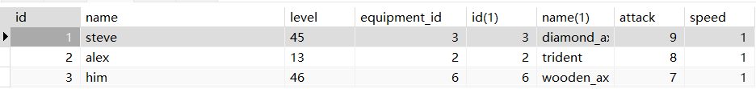

## 数据库基本概念

#### 什么是数据库

#### 数据库的一些特点

#### 关系型数据库

关系型数据库就是依照关系组建起来的数据库，它的呈现方式是一张表格，至于为什么是一张表格感兴趣可参见[其他部分](#其他部分)。常见的关系型数据库如MySQL，Oracle，Sql Server，Access

> 微软公司的Access常常被人吐槽：在数据量不大的时候不如Excel好用，在数据量很大的时候又不如MySQL好用。不过在一些地区，Access是高中信息课程中的内容

关系型数据库最大的优点就是数据结构清晰、易于理解、容易维护，能够确保数据的一致性和完整性。另外，关系型数据库还支持 SQL（Structured Query Language）语言，这是一种用于查询和操作数据库的标准语言，几乎所有的关系型数据库都支持 SQL

#### 非关系型数据库

即不依赖关系而组建起来的数据库。在更加复杂的开发场景中，我们要处理的数据五花八门，有可能无法像表格一样组织起来，这个时候就需要使用非关系型数据库了。

常见的非关系型数据库，如`MongoDB`，`Redis`

#### Navicat

如果你读过做**e时代的主人**，那么想必你一定下载了Navicat，如果还没有，请速速按照下面的步骤安装！！！

[Navicat的下载链接](https://www.navicat.com/en/download/navicat-premium)，找到适合你电脑的版本进行下载并安装

然后打开NavicatCracker，你应该可以在群文件中找到

> 这个过程中，windows  defender可能会讲Navicat Cracker视为有风险的文件并且删除，你需要手动在Windows安全中心将其恢复

接着请打开[这篇博客](https://www.cnblogs.com/zktww/p/16327163.html)，在断网情况下进行操作，然后你的Navicat就可以用了

当然了，我们也推荐一些其他的数据库可视化工具，

## SQL语句

SQL语句的一些例子如下

```SQL
SELECT * FROM users AS u LEFT JOIN admins AS a ON u.id = a.user_id ORDER BY u.id;

SELECT * FROM admins AS a LEFT JOIN users AS u ON u.id = a.user_id ORDER BY a.user_id;

SELECT * FROM users AS u INNER JOIN admins AS a ON u.id = a.user_id ORDER BY a.user_id;

INSERT INTO users (id,name) VALUES (101,"savanna");
```

+ SQL语句不区分大小写，但是为了可读性，通常把**SQL的关键字全大写**，表名、字段名等**自定义的东西用小写**
+ 一个SQL语句以分号结尾，这意味着对于过长的语句，可以多行编写，在最后一行结尾加上分号即可

#### 在Navicat中运行SQL语句

如下图，在上方菜单中进入**查询**，然后**新建查询**，就可以在下方工作区编写并运行`SQL`了


#### MySQL的数据类型

**数值类型**


**日期和时间类型**


**字符串类型**


**枚举与集合类型**

- **ENUM**: 枚举类型，用于存储单一值，可以选择一个预定义的集合。
- **SET**: 集合类型，用于存储多个值，可以选择多个预定义的集合。

可以看到，MySQL支持的数据类型还是非常广泛的，能够满足日常业务开发的需要

#### 查询语句

```mysql
SELECT <column1,column2...> FROM <table name>;
SELECT * FROM <table name>;
```

上述语句可以从表中查出相应列的数据，如果想要直接把所有的数据都查出来，可以直接使用通配符`*`

当然了，我们并不总是要把所有的行、所有的列都查出来，那么我们可以为查询加上一些筛选条件，从而获取部分数据

```mysql
SELECT <column1,column2...> FROM <table name>
WHERE <condition>;
```

`condition`就是筛选的条件，例子如下

| 意义         | 符号                           | 例子                    |
| ------------ | ------------------------------ | ----------------------- |
| 大于（小于） | >（<）                         | age > 18（age < 18）    |
| 大于等于     | >= （<=）                      | age >= 18 （age <= 18） |
| 等于         | =         注意哦不是两个等于号 | age = 18                |
| 条件的且     | AND                            | age > 18 AND age < 60   |
| 条件的或     | OR                             | age < 12 OR age > 60    |
| 在...之间    | BETWEEN     AND                | age BETWEEN 18 AND 60   |

> 对于数字类型的数据，可以做比价，这是很好理解的；对于文字类型的数据，则按照字典序进行比较；对于时间类型的数据，则按照时间的先后进行比较

当然，这些返回的数据是无序的（其实是插入的先后顺序），我们想要按照一定的顺序返回，只要再加上一个字句

```mysql
SELECT <column1,column2...> FROM <table name>
WHERE <condition>
ORDER BY <column1,column2...>;
```

传入多个列名作为比较依据，那么靠前的列优先级更高

如果我们把结果作为几页查询出来呢，就需要使用到LIMIT关键字了

```mysql
SELECT <column,column2...> FROM <table name>
WHERE <condition>
LIMIT <start>,<limit>
OFFSET <offset>;
```

> 比如 LIMIT 20，5    表示从第21个开始，并返回连续的5条数据

当然，还有另外一个关键字OFFSET，可以和LIMIT一起使用，实现分页

```mysql
...
LIMIT 5
OFFSET 10
...
```

这和 LIMIT 10,5  的效果是一样的

> *LIMIT*关键字在某些情况下的性能是较差的，此处不做深究，可自行查阅相关资料

#### 插入语句

使用下面的语句来插入数据

```mysql
INSERT INTO <table name> (column1,column2...) VALUES (value1,value2...)
```

这种方式可以指定你想要填入数据的列，如果不指定列，那么在`VALUES`后面跟的值的顺序要和表头的顺序一致

```mysql
INSERT INTO <table name> VALUES (value1,value2...);
```

插入的时候，值必须满足表的所有限制，比如不能为空，或者长度限制等。

#### 更新语句

更新一些数据使用下面的语句

```mysql
UPDATE <table name> SET column1 = value1,column2 = value2 WHERE <condition>;
```

在使用UPDATE的时候请保证有WHERE字句的限制，否则会将所有的数据都更新

#### 删除语句

删除数据使用下面的语句

```mysql
DELETE FROM <table name> WHERE <condition>;
```

这种删除方法会直接把数据从数据库中删除，称为**硬删除**，此外还有一种删除的方法，即添加一个字段来判断是否删除，比如添加`deleted_at`字段来记录删除时间，如果没有删除则置空，被称为**软删除**。在某些场景下，软删除可能更加合适。

那么相应的，在软删除中，我们并不需要真的删除数据，只要更新一个字段即可，比如：

```mysql
UPDATE admins SET deleted_at = NOW() WHERE id = 2;
```

#### 更高级的查询

在讲更高级的查询之前，我们首先了解表的连接


看这张图还是比较抽象的，我们举一些具体的例子来看看。

假如有如下的两张表，从上到下分别是sheet1，sheet2


那么可以看出，sheet1是一张玩家信息的表，sheet2是一张装备信息的表，于是有：

sheet1左连接sheet2

```mysql
SELECT * FROM sheet1 AS s1 LEFT JOIN sheet2 AS s2 ON s1.equipment_id = s2.id;
```


可以看到，sheet1的全部数据都在，而sheet2的数据仅仅按照sheet1的equipment_id添加到sheet2中

那么对称地，我们有右连接

```mysql
SELECT * FROM  sheet1 AS s1 RIGHT JOIN sheet2 AS s2 ON s1.equipment_id = s2.id;
```


尽管sheet1在Navicat里被放在了左边，但这确实是sheet1 RIGHT JOIN sheet2

> 可以自行验证，sheet1 LEFT JOIN sheet2 和 sheet2 RIGHT JOIN sheet1 是等价的

sheet1 内连接 sheet2

```mysql
SELECT * FROM sheet1 AS s1 INNER JOIN sheet2 AS s2 ON s1.equipment_id = s2.id;
```



内连接的结果和左连接或者右连接是相似的，从上面的图示也可以看出，它是取了两张表的交集连接在一起

#### 内置函数

MySQL有很多内置函数可直接调用，此处不一一列出，可自行参考<a href="https://www.runoob.com/mysql/mysql-functions.html">菜鸟教程</a>


 ## 数据库设计

#### E-R图

E-R模型方法的基本思想是在需求分析的基础上，用易于表达的`Entity(实体)`和`Relationship(关系)`图构造一个反映现实世界各类数据项的概念模式，并将概念模式转化成关系模式。

一个E-R图的例子


我们可以看到，实体用方形表示、关系用菱形表示，实体的属性用椭圆形表示

#### 主键、外键

主键，即每个数据项的唯一标识。在你的数据表中，存在一个唯一标识是十分有必要的，通常我们会把主键设置成id，即可以标识，也可以计数。

#### 索引

## Gorm的使用

[Gorm官方文档](https://gorm.io/zh_CN/docs/)

Gorm是一个Go语言的第三方库，实现了对关系型数据库的操作，使用下面的命令在获取Gorm

```cmd
go get -u gorm.io/gorm
go get -u gorm.io/driver/sqlite
```

#### 什么是ORM

ORM，即关系对象映射(Object Relation Mapping)，即编程中的对象和数据库中的关系之间的映射，我们在具体的操作数据库的时候，就不需要再去和复杂的SQL语句打交道，只要像平时操作对象一样操作它就可以了 。

Gorm，就是Go语言中的ORM，如上文所说，它是一个第三方库。

#### 让应用程序和数据库连接起来

我们前面说到，一个应用程序想要操作数据库，首先要和数据库建立连接。那么对于你的后端应用程序而言，当然也需要建立起连接，Gorm为我们提供了如下的建立连接的方式

```go
dsn := "<user>:<password>@tcp(<host>:port)/<dbname>?charset=utf8mb4&parseTime=True&loc=Local"
db, err := gorm.Open(mysql.Open(dsn), &gorm.Config{})
```

将其中的空缺部分补全，就可以建立和数据库的连接

`Open`方法所接受的第二个参数，是有关连接的配置，在这里，我们暂时不进行任何配置

或者你也可以采用下面的方法(来自官方文档)

```go
db, err := gorm.Open(mysql.New(mysql.Config{
  DSN: "gorm:gorm@tcp(127.0.0.1:3306)/gorm?charset=utf8&parseTime=True&loc=Local", // DSN data source name
  DefaultStringSize: 256, // string 类型字段的默认长度
  DisableDatetimePrecision: true, // 禁用 datetime 精度，MySQL 5.6 之前的数据库不支持
  DontSupportRenameIndex: true, // 重命名索引时采用删除并新建的方式，MySQL 5.7 之前的数据库和 MariaDB 不支持重命名索引
  DontSupportRenameColumn: true, // 用 `change` 重命名列，MySQL 8 之前的数据库和 MariaDB 不支持重命名列
  SkipInitializeWithVersion: false, // 根据当前 MySQL 版本自动配置
}), &gorm.Config{})
```

**连接池**：数据库连接池是一种管理和维护数据库连接的机制，用于提高数据库访问的性能和效率。连接池通过在应用程序启动时创建一组数据库连接，并在需要时将这些连接分配给应用程序，然后在不再需要时将其返回到池中。这可以减少创建和销毁数据库连接的开销，并优化数据库资源的使用。

连接的创建和销毁开销：
创建和销毁数据库连接是一项开销较大的操作。连接池通过预先创建一组连接，避免了每次请求都创建新连接的开销。这些连接在应用程序启动时初始化，并一直保持活动状态，直到应用程序关闭。

连接的重用：
连接池允许应用程序在需要时从池中获取连接，而不是每次都创建新连接。使用完毕后，连接可以被释放回池中以供其他请求使用。这种重用机制可以降低数据库服务器的负担，提高应用程序的性能。

#### 基础的Gorm语句

#### tz-gin中的Gorm

## Redis

Redis是一个开源（BSD许可），内存存储的数据结构服务器，可用作数据库，高速缓存和消息队列代理。它支持字符串，哈希表，列表、集合、有序集合，位图，hyperloglogs等数据类型。

#### 下载Redis

<a href="https://github.com/tporadowski/redis/releases">下载链接</a>

#### 打开 Redis

安装好的Redis分为两部分，`Redis-server`和`Redis-cli`，即服务器和客户端。在终端中打开服务器，使用下面的命令

```power
redis-server
```

打开之后大概是这样的


然后这个时候另外再打开一个终端，使用下面的命令打开客户端

```power
redis-cli
```

客户端打开之后大概是这样的


通常情况下，Redis是运行在6379端口的，然后就可以在客户端中使用Redis了

#### 使用 Redis

#### Go-Redis


## 其他部分（自行选读）

#### 为什么关系型数据库用表格呈现

我们首先来定义关系

> 定义一个 $n$ 元关系：对于集合$A_{1},A_{2}...A_{n}$，做它们的笛卡尔积$A_{1}\times A_{2}\times..A_{n}$，记为$A$，并且有集合$R\subseteq A$，那么$\forall a_{i}\in A_{i},1\le i\le n$，称它们有关系，当且仅当$(a_{1},a_{2}...a_{n})\in R$，$R$被称作为一个关系

有了上面关系的定义，我们来看一个例子

> 设$names = \{wjj,savanna,wwwwwanggggg,extra\_name\},skills=\{eat,sleep,laugh,nil\},ages=\{60,62,64,NaN\}$，那么并且有笛卡尔积的子集$\{(wjj,eat,60),(savanna,sleep,62),(wwwwwanggggg,nil,NaN)\}$是一个关系，我们可以把这个关系中的元素排列好，并在最顶部加上集合的名字，如下。那么这就是一张表格。

| names        | skills | ages |
| ------------ | ------ | ---- |
| wjj          | eat    | 60   |
| savanna      | sleep  | 62   |
| wwwwwanggggg | nil    | NaN  |

表格中的一横排我们也称为一个**元组**，每一列也称为某个字段的**域**

#### 数据库与数据结构简述

MySQL的索引使用B+树


